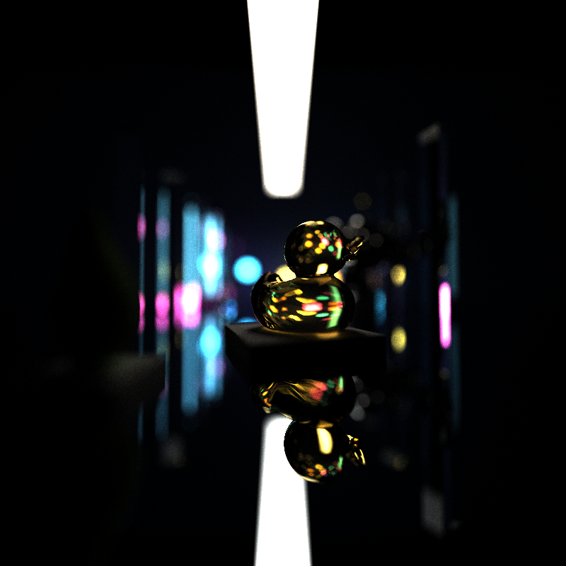
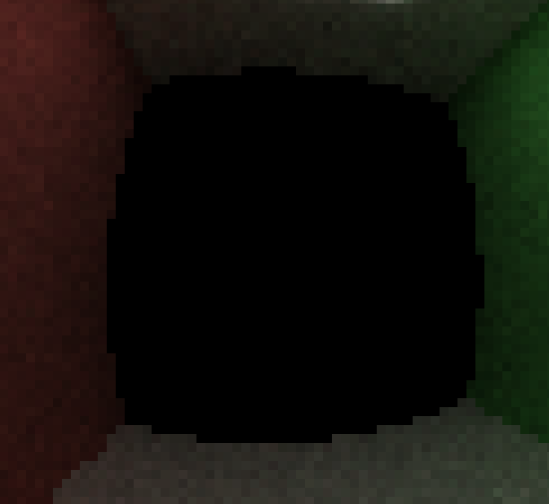
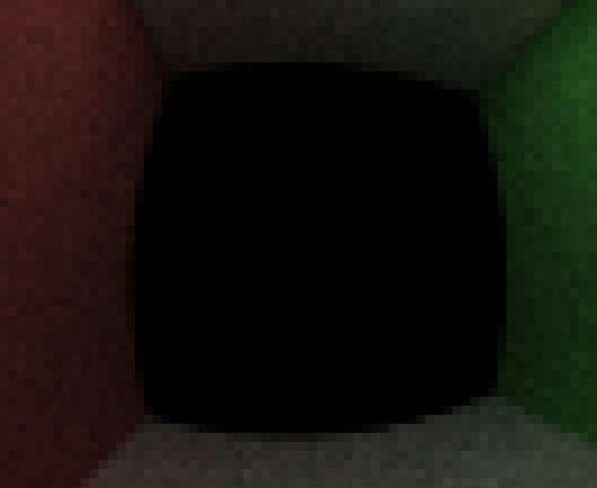
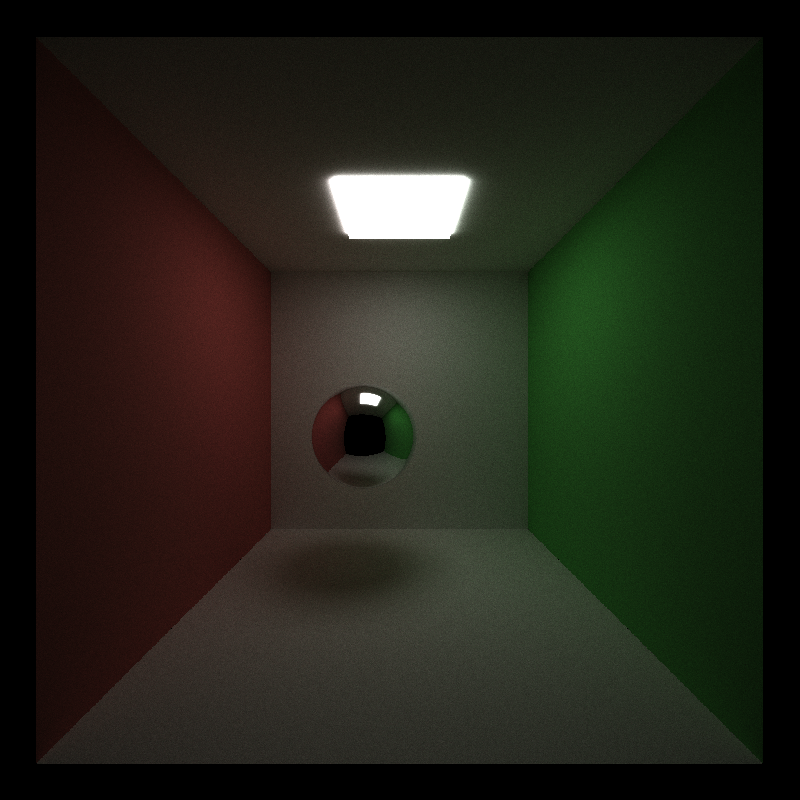
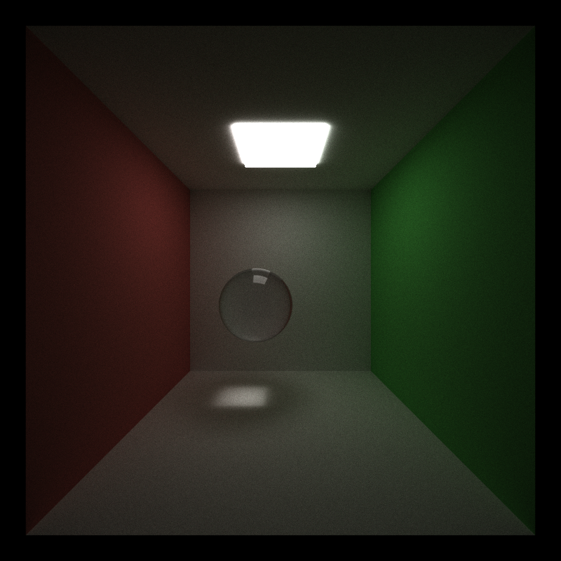
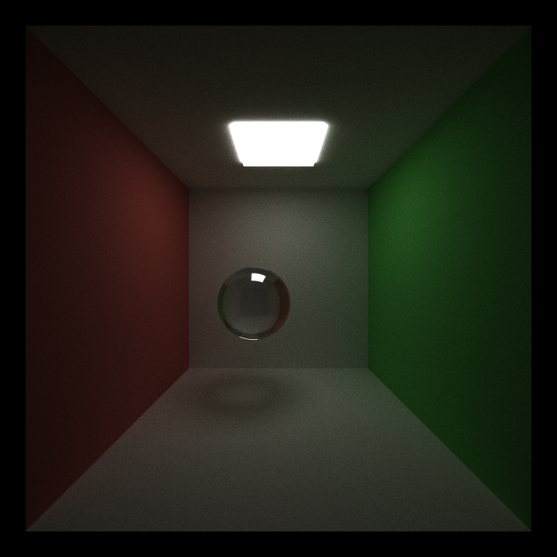
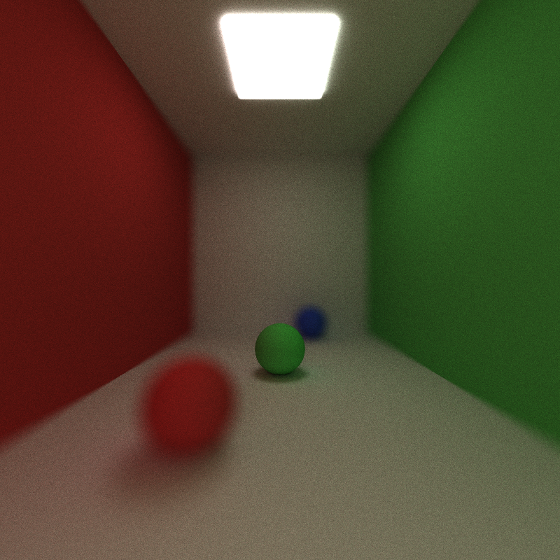
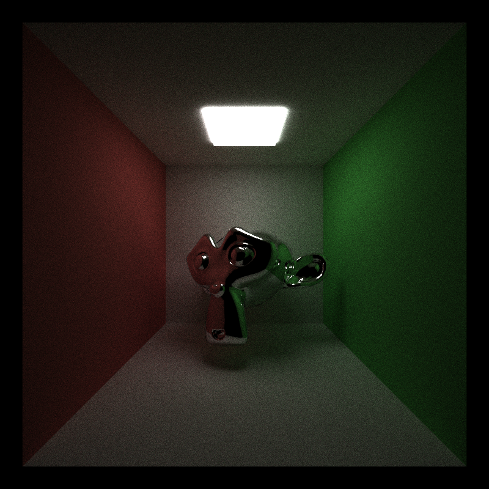
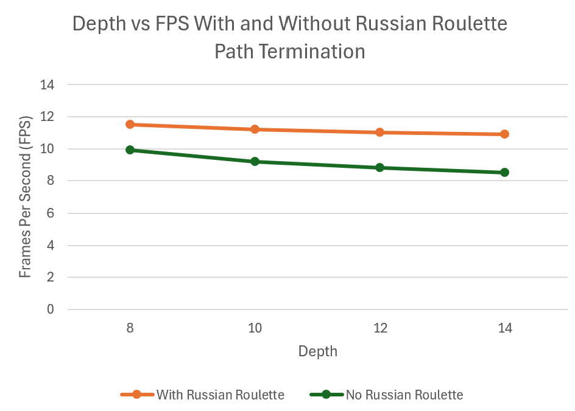
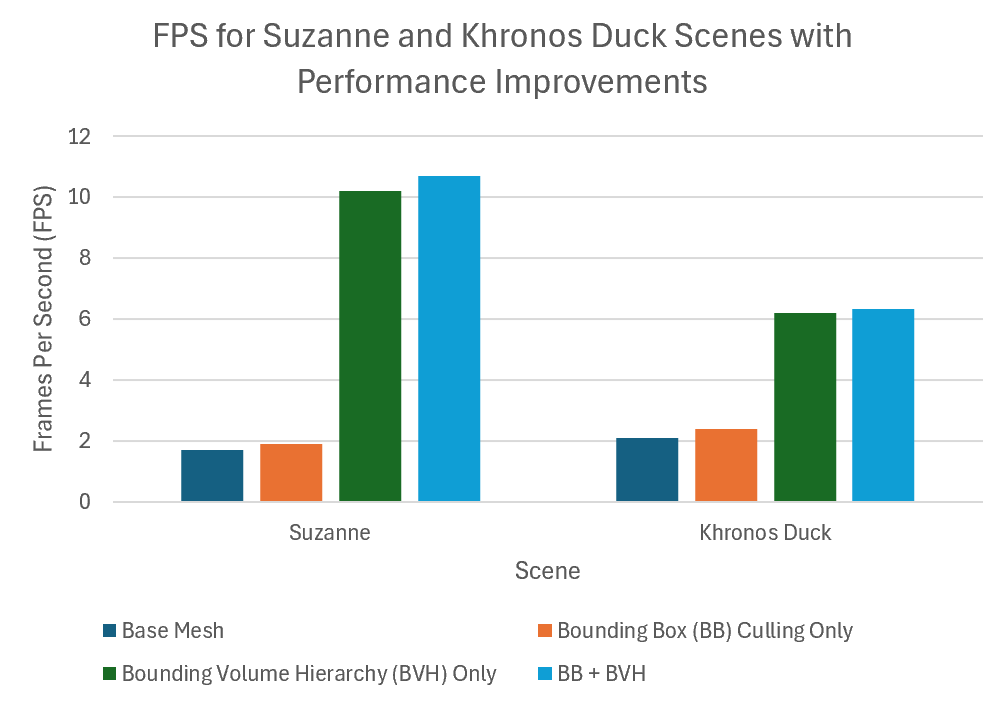

CUDA Path Tracer
================

**University of Pennsylvania, CIS 565: GPU Programming and Architecture, Project 3**

* Darrel Dsouza
* Tested on: Windows 11, i7-12700 @ 2.1GHz 32GB, NVIDIA T1000 4096MB (CETS Lab)

*Khronos Duck on a reflective floor, with depth of field (5000 iterations).*

## Overview

This is a GPU path tracer written in CUDA. It loads scenes from JSON, loads arbitrary glTF meshes with a BVH. Each iteration traces one path per pixel and the results are accumulated progressively. It implements various performance improvements such as russian roulette path termination, bounding box culling and BVH, as well as visual improvements, including support for reflective and refractive surfaces, physically based depth of field, and support for loading in mesh objects (glTF).

## Features

### Core Improvements
* **Sorting by material type** – path segments and intersections are sorted by material ID before shading so that threads access processing the same material access consecutive areas in memory.
  Toggle with `--sort-materials`.
* **Stochastic sampled antialiasing** – each iteration jitters the camera ray within the pixel to reduce the jagged line effect at the edges of objects.

| Without antialiasing (1000 iters) | With antialiasing (1000 iters) |
| :---: | :---: |
|  |  |

### Extended Features and Improvements

#### Visual Improvements

* **Refraction with Fresnel effects (Schlick's approximation)** – Implemented refraction using Schlick approximation of the Fresnel reflectance, using each material's index of refraction (IOR)

| Perfect specular | Glass (IOR 1.5) | Diamond (IOR 2.42) |
| :---: | :---: | :---: |
|  |  |  |

The higher IOR of the diamond gives stronger bending and more internal reflection compared to glass which has a lower IOR so less internal reflection is seen.

* **Physically-based depth of field** – rays are generated on the surface of a thin lens so that objects away from the focal distance blur. Lens radius and focal distance are set in the camera setup within the scene.json file

#### Mesh Improvements

* **Arbitrary glTF mesh loading** – meshes are loaded with tinygltf (`.gltf` + `.bin`) Example meshes (Suzanne, Khronos Duck) are included in [scenes/models](scenes/models).
* **Toggleable bounding volume intersection culling** – each mesh has an axis-aligned bounding box that is tested first. The mesh's triangles are only tested if the ray hits the box. Disable with `--no-bbox-culling`.

*Suzanne with a reflective material (1000 iterations).*

#### Performance Improvements

* **Russian roulette path termination** – after a few bounces, paths are randomly terminated with probability based on their remaining throughput. Then, the survivors are re-weighted. This can be enabled with the command line flag `--russian-roulette`.
* **Hierarchical spatial data structure (BVH)** – triangles are organized in a bounding volume hierarchy built on the CPU and flattened into an array for stack-based traversal on the GPU. This is on by default but can be disabled using the command line flag `--no-bvh`.

## Performance Analysis

### Russian roulette

Measured on the glass Cornell box scene. Without Russian roulette, FPS drops from ~9.9 to ~8.5 as the
max depth increases from 8 to 14, since long paths in the glass keep surviving and costing work. With Russian
roulette, FPS stays at roughly 11.5 → 10.9: low-throughput paths are cut early, so raising the depth limit adds
almost no cost. At depth 14 this is about a 28% speedup.

### BVH and bounding box culling

| Scene | Base mesh | BB culling only | BVH only | BB + BVH |
| :--- | :---: | :---: | :---: | :---: |
| Suzanne | ~1.7 FPS | ~1.9 FPS | ~10.2 FPS | ~10.7 FPS |
| Khronos Duck | ~2.1 FPS | ~2.4 FPS | ~6.2 FPS | ~6.3 FPS |

* Without acceleration every ray tests every triangle, which is O(N) per ray. Bounding-box culling helps only
  modestly (~10–15%) because since we only have one large mesh, most of the rays are hitting the bounding box and are therefore tested against the mesh.
* The BVH gives a large speedup (~6x on Suzanne, ~3x on the duck) because traversal is limited to around O(log N) per ray.
* BB culling on top of the BVH have a cumulative effect, which is largely outweighed by the effect of BVH.

## Third-Party Libraries

* [tinygltf](https://github.com/syoyo/tinygltf) v2.9.7 – glTF loading. Added in `external/include/tiny_gltf.h`
  (with its dependencies) and compiled in `src/tinygltf_impl.cpp`. No other build changes beyond adding this
  source file to `CMakeLists.txt`.
